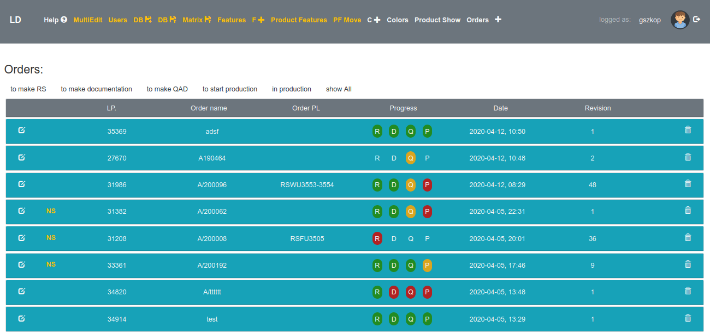

# Product Configurator
> It is servis that allows creating many configuration of product that we are producing.
I allows to create order of product with many options that we can configure.
It is possible to track progress of each order.
## Table of contents
* [General info](#general-info)
* [Screenshots](#screenshots)
* [Technologies](#technologies)
* [Setup](#setup)
* [Features](#features)
* [Status](#status)
* [Inspiration](#inspiration)
* [Contact](#contact)

## General info
Project allows creating project and tasks that will be planed in time.
Tasks have different status depending on progress that can be change as project progress. 

## Screenshots

## Technologies
* Java 8
* Spring
* HTML
* JS

## Setup
Make war file, put in on server.
Database is H2, as in application.properties is defined.
When run you can create new user.

## Features
List of features
* creating products with many avalible options
* posibility to edit created product
* creating order based on created product
* processing no standard orders
* tacking progress od order

Description of all functions: [link](https://drive.google.com/file/d/19Zh4HRJ8_HrQRvFSHc4BWmVR94GdGbzZ/view?usp=sharing)

## Status
Project is:  finished

## Inspiration
I made it to help processing orders in company I worked for.

## Contact
Created by szkop.grzegorz@gmail.com - feel free to contact me!
